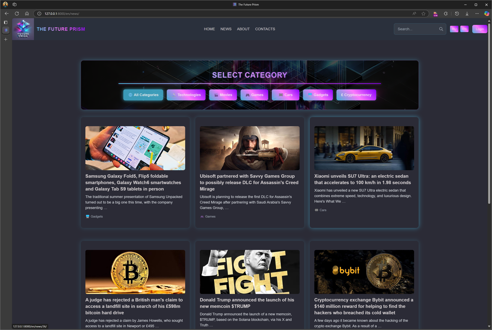
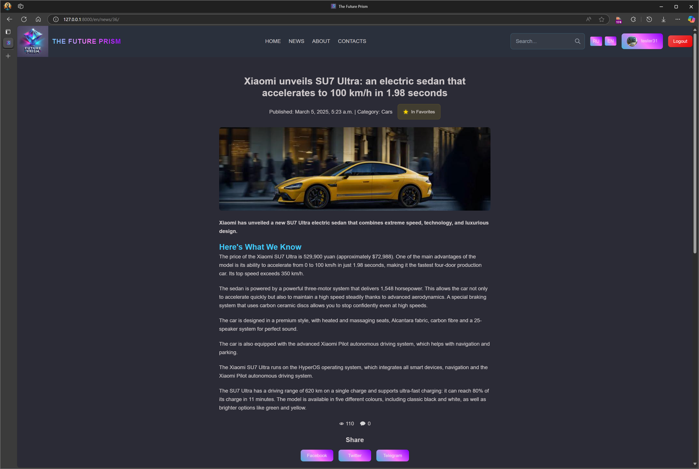
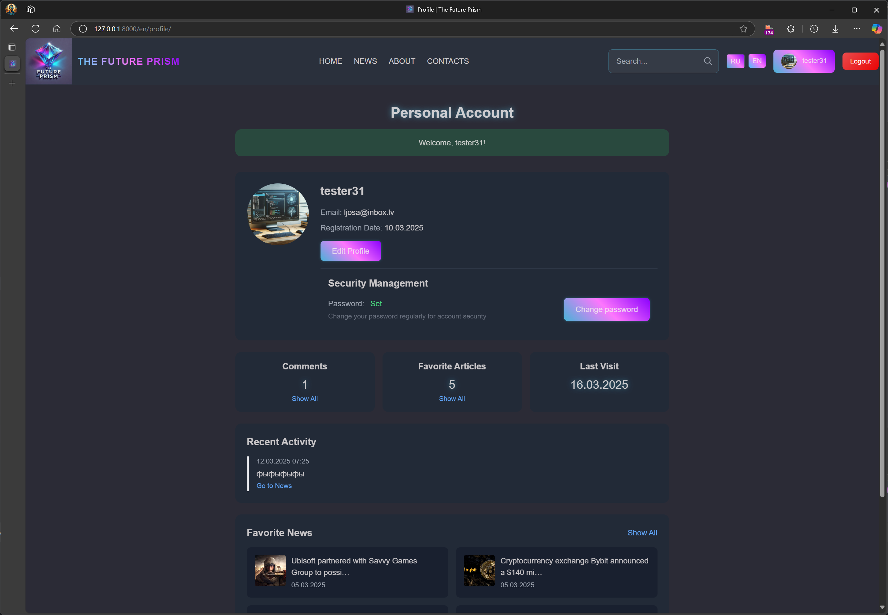
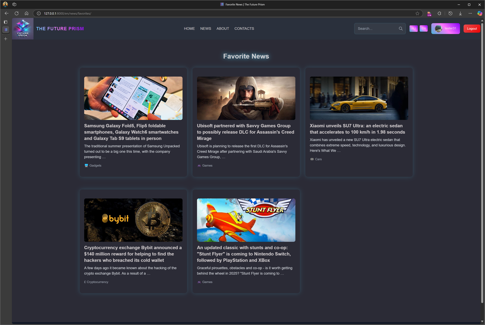
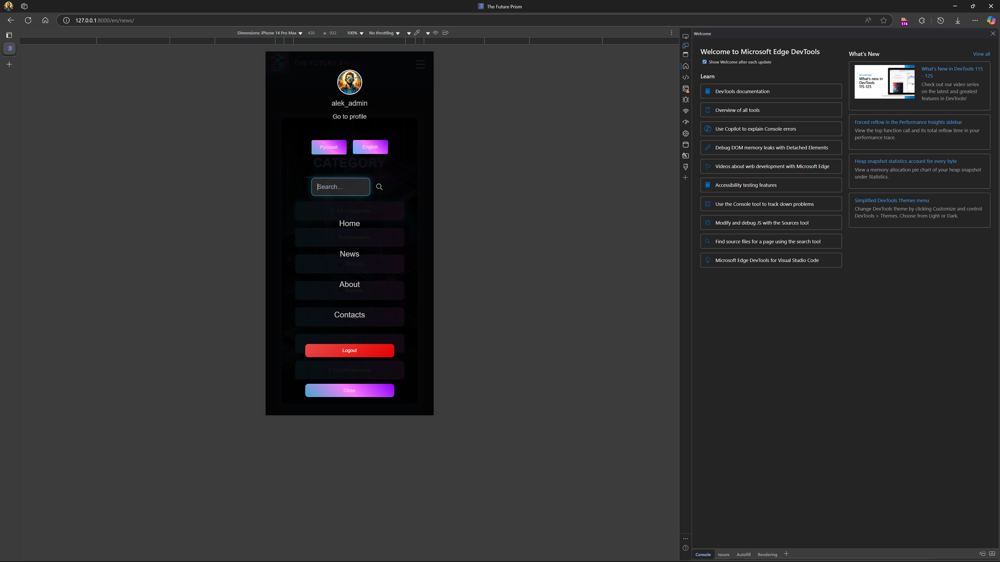

# 🌟 The Future Prism - Technology & Future News Portal 🚀

**"The Future Prism"** is a modern news portal dedicated to technology, society, and the future. The platform provides a user-friendly interface for reading, publishing, and discussing news.

---


## 📸 Screenshots

### Home Page with News Categories


### Article Detail View


### User Profile with Activity History


### Favorites Collection Page


### Mobile Responsive Design


---
## 📌 Key Project Features

✅ Intuitive user interface  
✅ News categorization system  
✅ Enhanced user profiles with avatars  
✅ Comments and likes system  
✅ Favorites article list for personalized reading  
✅ Responsive modern design  
✅ Optimized API integration  
✅ Multilingual interface  

---

## 🏗️ Technology Stack

### 🔹 **Backend**
- **Programming Language:** Python 3.11  
- **Framework:** Django 5.1  
- **Database:** PostgreSQL 13  
- **Caching:** Redis 6  
- **Asynchronous Tasks:** Celery  
- **Authentication:** JWT (DRF SimpleJWT)  
- **REST API:** Django REST Framework  
- **API Documentation:** Swagger/OpenAPI (drf-yasg)  

### 🎨 **Frontend**
- **Languages:** HTML5, CSS3, JavaScript  
- **Styling:** Tailwind CSS  
- **Content Editor:** TinyMCE  
- **Interactive Components:** HTMX  

### ⚙️ **Infrastructure**
- **Containerization:** Docker + Docker Compose  
- **CI/CD:** GitHub Actions  
- **Web Server:** Gunicorn + Nginx  
- **Logging and Monitoring**  

---

## 📂 Project Structure

The project follows a modular architecture separating core functionality from independent applications:

```
the_future_prism/
├── core/                 # Core project files
│   ├── settings/         # Settings for different environments (dev, prod)
│   ├── urls.py           # Main URL routes
│   └── views.py          # Common views
├── apps/                 # Project applications
│   ├── users/            # User management system
│   │   ├── api/          # API components
│   │   └── services.py   # Business logic
│   ├── news/             # News publication module
│   │   ├── api/          # API components
│   │   └── services.py   # Business logic
│   ├── comments/         # Comments management
│   └── analytics/        # Data analysis and statistics
├── templates/            # Common templates
│   ├── base.html
│   └── includes/         # Reusable components
├── static/               # Common static files
└── media/                # User-uploaded files
```

Each application contains:
- Models, views, and forms
- Service layer for business logic
- Separate API components
- App-specific static files
- Tests for all components

---

## 🛠️ Installation and Setup

### 🔹 **Prerequisites**
- Python 3.11+
- PostgreSQL 13+
- Redis 6+
- Docker (optional)
- Python virtual environment (recommended)

### 🔹 **Installation Steps**
1. Clone the repository:
```bash
git clone https://github.com/AleksejsGir/the_future_prism.git
cd the_future_prism
```

2. Create a virtual environment and install dependencies:
```bash
python -m venv venv
source venv/bin/activate  # (Linux/macOS) or venv\Scripts\activate  # (Windows)
pip install -r requirements.txt
```

3. Configure the `.env` file (see `.env.example` for reference)

4. Apply migrations and start the server:
```bash
python manage.py migrate
python manage.py runserver
```

5. Create a superuser for admin panel access:
```bash
python manage.py createsuperuser
```

### 🔹 **Docker Setup**
```bash
docker-compose up -d
docker-compose exec web python manage.py migrate
docker-compose exec web python manage.py createsuperuser
```

---

## 🔥 API and Integrations

- **REST API** with full functionality access  
- **Swagger/OpenAPI** documentation  
- **JWT authentication** for secure access  
- **Filtering and search** for all resources  
- **Pagination and caching**  

📌 **API documentation is available at:**  
`/api/docs/` (Swagger UI)

Detailed API documentation can be found in the [API_DOCUMENTATION.en.md](API_DOCUMENTATION.en.md) file.

---

## 🔒 Security and Optimization

🔹 Protection against XSS, CSRF, and SQL injections  
🔹 Request rate limiting  
🔹 Query optimization using select_related and prefetch_related  
🔹 Request caching through Redis  
🔹 Lazy loading for images  
🔹 CSS and JavaScript minification  

---

## 📊 Testing

The project includes a comprehensive test suite for all components:

```bash
# Run all tests
python manage.py test

# Run tests for a specific application
python manage.py test apps.news

# Run tests with coverage report
coverage run --source='.' manage.py test
coverage report
```

---

## 🌍 Deployment

📦 **Docker**  
```bash
docker-compose up --build
```

📡 **Production (Gunicorn + Nginx)**  
```bash
docker-compose -f docker-compose.prod.yml up -d
```

⏳ **CI/CD (GitHub Actions)**  
- Automatic testing for each push and pull request  
- Secure storage of secrets  
- Automatic deployment when merging to main  

An example CI/CD configuration can be found in the [.github/workflows/ci.yml](.github/workflows/ci.yml) file.

---

## 📅 Current Development Stage

### ✅ **Completed**
✔️ Basic architecture and modular structure  
✔️ Authentication, user profiles with avatars  
✔️ Core news functionality and categories  
✔️ Favorites system  
✔️ Secure deployment configuration  
✔️ Static file optimization  
✔️ API documentation  

### 🔄 **In Progress**
🔸 Comments system enhancement  
🔸 Analytics implementation  
🔸 Performance optimization  

### 🚀 **Planned**
🔹 Social media integration  
🔹 Advanced search with relevance  
🔹 Recommendation system based on preferences  
🔹 Mobile application development  

---

## 🤝 Contributing

We welcome contributions to The Future Prism project:

1. Fork the repository
2. Create your feature branch (`git checkout -b feature/amazing-feature`)
3. Commit your changes (`git commit -m 'Add amazing feature'`)
4. Push to the branch (`git push origin feature/amazing-feature`)
5. Create a Pull Request

---

## 📄 License

This project is licensed under the [Apache License 2.0](LICENSE).
See the [NOTICE](NOTICE) file for attribution.

## 👨‍💻 Author

<div align="center">
  <table>
    <tr>
      <td align="center">
        <a href="https://github.com/AleksejsGir">
          
          <br />
          <sub><b>Aleksejs Giruckis</b></sub>
        </a>
        <br />
        <sub>Full-Stack Developer</sub>
        <br />
        <a href="https://github.com/AleksejsGir">GitHub</a> •
        <a href="mailto:aleksej.it.gir@gmail.com">Email</a> •
        <a href="https://linkedin.com/in/aleksejs-giruckis-0569a7353">LinkedIn</a>
      </td>
    </tr>
  </table>
</div>

---

## 🎉 Acknowledgements

This project is developed using Django best practices and modern technologies.

💡 **The Future Prism** — your portal to the world of the future!  
📧 **Contact:** [aleksej.it.gir@gmail.com](mailto:aleksej.it.gir@gmail.com)

---